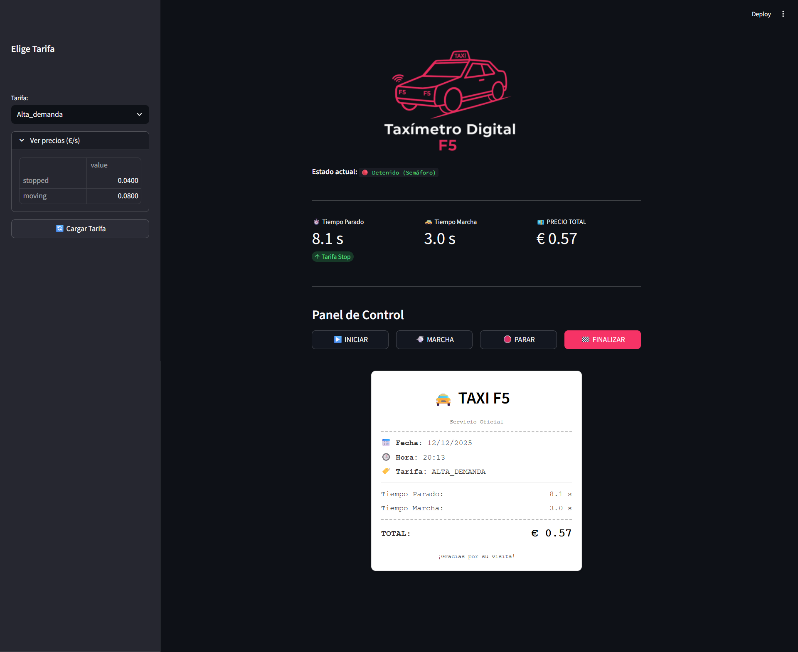

# 🚕 Taxímetro Digital F5

[](https://www.python.org/downloads/)
[](https://www.docker.com/)
[](LICENSE)

Sistema de taxímetro digital desarrollado en Python con múltiples interfaces (CLI, GUI y Web) para el cálculo preciso de tarifas de taxi.

---

## 📋 Tabla de Contenidos

- [Descripción](#-descripción)
- [Características](#-características-principales)
- [Estructura del Proyecto](#️-estructura-del-proyecto)
- [Instalación](#-instalación)
- [Uso](#-uso)
- [Configuración](#️-configuración-de-tarifas)
- [Tests](#-tests)
- [Docker](#-docker)
- [CI/CD](#-cicd-pipeline)
- [Tecnologías](#️-tecnologías-utilizadas)
- [Roadmap](#-roadmap)
- [Licencia](#-licencia)

---

## 📖 Descripción

Este proyecto implementa un **sistema completo de taxímetro** que calcula tarifas basadas en tiempo parado y en movimiento. Desarrollado como parte de un bootcamp de IA, el proyecto evoluciona desde una interfaz de línea de comandos básica hasta una aplicación web moderna completamente dockerizada.

**Objetivo**: Modernizar el sistema de facturación de taxis mediante un prototipo digital que permita calcular tarifas de manera precisa, eficiente y con múltiples opciones de interfaz según las necesidades del usuario.

---

## ✨ Características Principales

* **💰 Cálculo de Tarifas**: Tarifas diferenciadas por tiempo parado y en movimiento
* **🔧 Configuración Flexible**: Múltiples modos de tarifa (Normal, Alta Demanda, Nocturno)
* **📊 Sistema de Logs**: Trazabilidad completa de eventos
* **📝 Historial de Viajes**: Registro de todos los trayectos
* **🧪 Tests Unitarios**: Cobertura de funcionalidades críticas
* **🎨 Múltiples Interfaces**: CLI, GUI (Tkinter) y Web (Streamlit)
* **🐳 Dockerizado**: Despliegue sencillo con Docker y Docker Compose
* **⚙️ CI/CD**: Pipeline automatizado con GitHub Actions

---

## 🗂️ Estructura del Proyecto

```
taximetro-f5/
│
├── .github/
│   └── workflows/
│       └── ci-cd.yml              # Pipeline de integración continua
│
├── .streamlit/
│   └── config.toml                # Tema y configuración de Streamlit
│
├── data/
│   └── trips_history.txt          # Historial de todos los viajes
│
├── logs/
│   └── taximeter.log              # Logs del sistema
│
├── src/
│   ├── app.py                     # 🌐 Aplicación web (Streamlit)
│   ├── gui_taximeter.py           # 🖼️ Interfaz gráfica (Tkinter)
│   ├── main.py                    # 💻 CLI principal
│   ├── oop_taximeter.py           # 🏗️ Clase Taximeter (lógica OOP)
│   └── pricing.py                 # 💰 Gestión de tarifas
│
├── tests/
│   └── test_main.py               # 🧪 Tests unitarios
│
├── config_prices.json             # ⚙️ Configuración de tarifas
├── Dockerfile                     # 🐳 Imagen Docker
├── docker-compose.yml             # 🐳 Orquestación de contenedores
├── requirements.txt               # 📦 Dependencias de Python
└── README.md                      # 📖 Este archivo
```

---

## 🚀 Instalación

### 📋 Requisitos Previos

- **Python 3.11 o superior**
- **Docker** (opcional, para ejecución containerizada)
- **Git**

### Opción 1️⃣: Instalación Local

```bash
# 1. Clonar el repositorio
git clone https://github.com/Bootcamp-IA-P6/Proyecto1_Gema_Yebenes.git
cd Proyecto1_Gema_Yebenes

# 2. Crear entorno virtual (recomendado)
python -m venv venv

# 3. Activar entorno virtual
# En Windows:
venv\Scripts\activate
# En macOS/Linux:
source venv/bin/activate

# 4. Instalar dependencias
pip install --upgrade pip
pip install -r requirements.txt
```

### Opción 2️⃣: Docker (Recomendado)

```bash
# Clonar repositorio
git clone https://github.com/Bootcamp-IA-P6/Proyecto1_Gema_Yebenes.git
cd Proyecto1_Gema_Yebenes

# Construir y ejecutar con Docker Compose
docker compose up

# La aplicación estará disponible en: http://localhost:8501
```

---

## 💻 Uso

### 1️⃣ Interfaz de Línea de Comandos (CLI)

La versión CLI ofrece una experiencia de terminal enriquecida con colores y tablas.

```bash
python src/main.py
```

#### Comandos Disponibles:

| Comando | Descripción |
|---------|-------------|
| `start` | Inicia un nuevo viaje (estado inicial: parado) |
| `stop` | Cambia el estado del taxi a parado |
| `move` | Cambia el estado del taxi a en movimiento |
| `finish` | Finaliza el viaje y muestra el resumen |
| `exit` | Sale del programa |

#### Ejemplo de Uso:

```
> start
▶️ Trip started!
⏸️ Initial state: STOPPED

> move
🚕 Taxi is MOVING

> stop
⏸️ Taxi is STOPPED

> finish

🚕 Trip Summary
┏━━━━━━━━━┳━━━━━━━━━━━━━━━━━┳━━━━━━━━━━┓
┃ State   ┃ Time (seconds)  ┃ Cost (€) ┃
┡━━━━━━━━━╇━━━━━━━━━━━━━━━━━╇━━━━━━━━━━┩
│ Stopped │ 15.2            │ 0.30     │
│ Moving  │ 30.5            │ 1.53     │
│ TOTAL   │                 │ 1.83     │
└─────────┴─────────────────┴──────────┘
```

---

### 2️⃣ Interfaz Gráfica (GUI) - Tkinter

Interfaz visual con botones y selector de tarifa.

```bash
python src/gui_taximeter.py
```

#### Características:

- 🎚️ **Selector de tarifa** con radio buttons
- 🟢 **Botón START**: Inicia el viaje
- 🟡 **Botón MOVE**: Cambia a estado en movimiento
- 🔴 **Botón STOP**: Cambia a estado parado
- 🏁 **Botón FINISH**: Finaliza y muestra resumen en popup
- 📊 **Indicadores visuales** del estado actual

---

### 3️⃣ Aplicación Web (Streamlit)

La versión web ofrece la experiencia más moderna y visual.

#### Ejecución Local:

```bash
streamlit run src/app.py
```

#### Con Docker:

```bash
docker compose up
```

Accede a: **http://localhost:8501**

#### Características Web:

- ⏱️ **Actualización en tiempo real** (cada 0.5 segundos)
- 📊 **Dashboard con métricas** (tiempo parado, tiempo en movimiento, precio total)
- 🎛️ **Selector de tarifa en sidebar** con tabla de precios
- 🎮 **Panel de control** con botones interactivos
- 🎫 **Ticket digital** al finalizar el viaje
- 🎨 **Diseño moderno** con tema oscuro
- 📱 **Responsive** (adaptable a móviles)

---

## ⚙️ Configuración de Tarifas

Las tarifas se definen en el archivo **`config_prices.json`**:

```json
{
  "Normal": {
    "stopped": 0.02,
    "moving": 0.05
  },
  "Alta_demanda": {
    "stopped": 0.04,
    "moving": 0.08
  },
  "Nocturno": {
    "stopped": 0.03,
    "moving": 0.06
  }
}
```

### Explicación:

- **stopped**: Precio por segundo cuando el taxi está parado (€/s)
- **moving**: Precio por segundo cuando el taxi está en movimiento (€/s)

### Añadir Nuevas Tarifas:

Simplemente agrega un nuevo objeto al JSON:

```json
{
  "Mi_Tarifa_Personalizada": {
    "stopped": 0.025,
    "moving": 0.055
  }
}
```

---

## 🧪 Tests

El proyecto incluye tests unitarios para garantizar el correcto funcionamiento.

### Ejecutar Todos los Tests:

```bash
python -m unittest discover -s tests -p "test_*.py"
```

### Ejecutar Test Específico:

```bash
python -m unittest tests.test_main.TestCalculateFare
```

### Ejemplo de Salida:

```
...
----------------------------------------------------------------------
Ran 3 tests in 0.002s

OK
```

### Casos de Prueba Incluidos:

- ✅ Cálculo básico con tiempo parado y en movimiento
- ✅ Cálculo solo con tiempo parado
- ✅ Cálculo solo con tiempo en movimiento

---

## 📊 Sistema de Logs

Todos los eventos importantes se registran automáticamente en **`logs/taximeter.log`**.

### Información Registrada:

- ⏰ **Timestamp** de cada evento
- 🔖 **Nivel de log** (INFO, WARNING, ERROR)
- 📝 **Detalles** de viajes y cambios de estado

### Ejemplo de Log:

```
2025-12-04 12:28:37 - INFO - Taximeter program started
2025-12-04 12:28:45 - INFO - State changed from stopped to moving (duration: 8.2s)
2025-12-04 12:29:03 - INFO - Trip finished. Stopped: 11.6s, Moving: 7.9s, Total: €0.82
```

---

## 📝 Historial de Viajes

Cada viaje completado se guarda automáticamente en **`data/trips_history.txt`**.

### Formato del Historial:

```
2025-12-03 14:51:23 | stopped=17.5s | moving=20.7s | total=1.38
2025-12-03 14:53:45 | stopped=16.8s | moving=19.2s | total=1.30
2025-12-04 09:10:41 | stopped=9.3s  | moving=4.7s  | total=0.42
```

Este archivo permite:
- 📈 Analizar patrones de uso
- 📊 Generar estadísticas
- 💼 Auditoría de viajes

---

## 🐳 Docker

### Construcción Manual de Imagen:

```bash
# Construir imagen
docker build -t taximetro-app .

# Ejecutar contenedor
docker run -p 8501:8501 taximetro-app
```

### Con Docker Compose (Recomendado):

```bash
# Iniciar servicios
docker compose up

# Modo detached (segundo plano)
docker compose up -d

# Ver logs
docker compose logs -f

# Detener servicios
docker compose down
```

### Características del Contenedor:

- ✅ **Puerto 8501** expuesto para Streamlit
- ✅ **Volúmenes montados** para desarrollo en caliente
- ✅ **Healthcheck** para verificar estado de la aplicación
- ✅ **Configuración optimizada** para producción

---

## 🔄 CI/CD Pipeline

El proyecto incluye un pipeline completo de GitHub Actions.

### Workflow Automatizado:

1. **🧪 Test Stage**: 
   - Ejecuta tests unitarios
   - Valida la calidad del código
   
2. **🏗️ Build Stage**: 
   - Construye imagen Docker
   - Optimiza para producción
   
3. **📦 Push Stage**: 
   - Sube imagen a GitHub Container Registry
   - Etiqueta con nombre de rama

### Imagen Pública:

```bash
docker pull ghcr.io/bootcamp-ia-p6/proyecto1_gema_yebenes:main
```

### Triggers:

- ✅ Push a `main` o `develop`
- ✅ Manual workflow dispatch

---

## 🛠️ Tecnologías Utilizadas

| Tecnología | Propósito |
|------------|-----------|
|  | Lenguaje principal |
|  | Framework web |
|  | Interfaz gráfica nativa |
|  | Containerización |
|  | Automatización CI/CD |

### Librerías Python:

```python
streamlit>=1.28.0    # Framework web interactivo
rich>=13.7.0         # CLI con colores y formato
pandas>=2.1.0        # Manipulación de datos
```

---

## 🎯 Roadmap

### ✅ Completado

- [x] CLI básica funcional
- [x] Sistema de logs
- [x] Tests unitarios
- [x] Historial de viajes
- [x] Configuración de tarifas
- [x] Refactorización OOP
- [x] Interfaz gráfica (Tkinter)
- [x] Aplicación web (Streamlit)
- [x] Dockerización completa
- [x] CI/CD Pipeline

### 🚧 En Desarrollo

- [ ] Sistema de autenticación con contraseñas
- [ ] Base de datos PostgreSQL para persistencia
- [ ] API REST con FastAPI
- [ ] Dashboard de estadísticas avanzadas

### 🔮 Futuro

- [ ] Integración con GPS para cálculo por distancia
- [ ] Sistema de múltiples usuarios (taxistas)
- [ ] Generación de informes PDF
- [ ] App móvil (React Native)
- [ ] Sistema de pagos integrado

---

## 📄 Licencia

Este proyecto es con fines educativos y no tiene licencia comercial.

---

## 👤 Autor

**Desarrollado por:** Gema Yébenes

- 🎓 Proyecto educativo del Bootcamp de IA
- 💼 [LinkedIn](https://www.linkedin.com/in/gema-y%C3%A9benes-caballero-83b6a6100/)
- 🐙 [GitHub](https://github.com/gemayc)
---

## 🙏 Agradecimientos

- **Bootcamp de IA** por la estructura y guía del proyecto
- **Comunidad de Python** por las excelentes librerías open source
- **Streamlit Team** por facilitar el desarrollo de aplicaciones web
- **Docker** por simplificar el despliegue de aplicaciones

---

## 📸 Screenshots


### CLI Interface
```
🚕 TAXIMETER
Commands:
▶️ start
⏸️ stop
🚕 move
✅ finish
❌ exit
```

### Web Interface (Streamlit)
- Dashboard moderno con métricas en tiempo real
- Selector de tarifa intuitivo
- Ticket digital profesional

---

<div align="center">

**⭐ Si este proyecto te resulta útil, ¡dale una estrella en GitHub! ⭐**

[](https://github.com/Bootcamp-IA-P6/Proyecto1_Gema_Yebenes/stargazers)
[](https://github.com/Bootcamp-IA-P6/Proyecto1_Gema_Yebenes/network/members)

Hecho con ❤️ y ☕ durante el Bootcamp de IA

</div>
